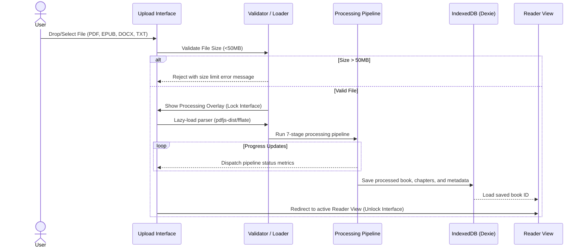
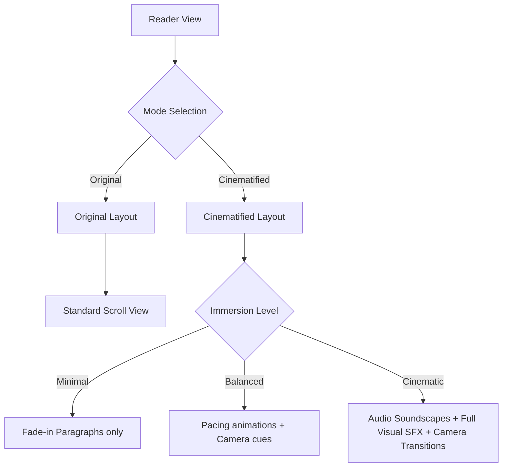
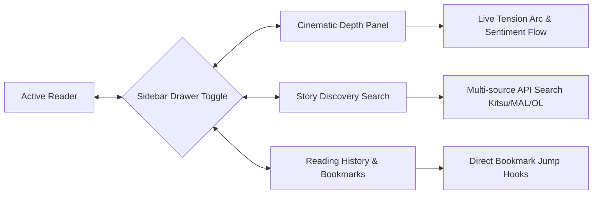

# Application Flow Map — InfinityCN

**Document Version:** 1.0.0  
**Project Version:** 15.0.0  
**Status:** Approved

---

## 1. File Import & Processing Flow

This flow handles document ingest, format validation, and pipeline tracking.

### Key States:
*   **Intake State:** File selection active; options for heuristic vs. AI-assisted models displayed.
*   **Processing Overlay:** Full-screen blocking modal tracking the 7 processing stages with spinner and stage completion badges.
*   **Success Route:** Seamless slide transition into the reader.

---

## 2. Interactive Reading Modes

Once inside the Reader, the user controls how the narrative is delivered.

### Action Controls:
*   **Original / Cinematified Toggle:** Switches the DOM rendering engine from standard text lists to chronological animators.
*   **Immersion Panel:** Quick drawer overlay adjusting animations, sounds, and accessibility variables.

---

## 3. Sidebar Widgets & Navigation

The Reader View houses interactive drawers that slide in without disrupting reading progress.

*   **Cinematic Depth Panel:** Instantly pulls active rendering statistics from the Zustand store.
*   **Story Discovery Drawer:** Renders recommendations with media badges (e.g. Manga, Novel, Manhwa). Filters search queries locally or remotely.

---

## 4. User Feedback Submission

Allows readers to report issues or suggest improvements without leaving their reading page.

*   **Trigger:** Reader footer or panel menu contains a "Feedback" button.
*   **Modal Form:** Collects user feedback text, categorization tags, and rating scores.
*   **Persistence:** Writes to local IndexedDB `feedback` table. Updates the "Feedback History" view in settings instantly.
