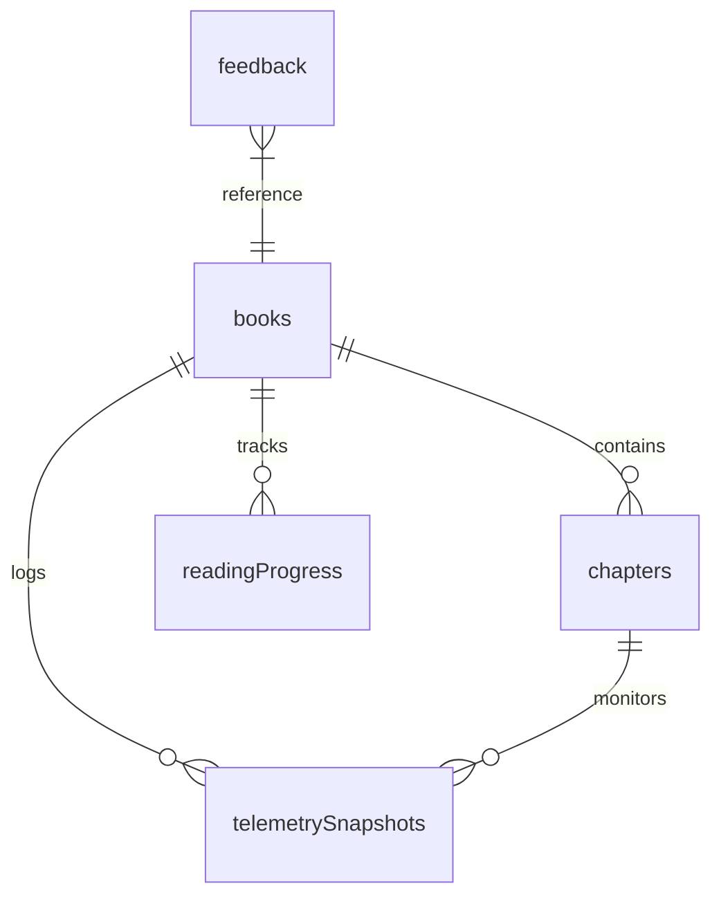

# Backend & Storage Schema — InfinityCN

**Document Version:** 1.0.0  
**Project Version:** 15.0.0  
**Status:** Approved  
**Engine:** Dexie (IndexedDB) & Appwrite Client

---

## 1. Local Database Schema (Dexie)

Dexie acts as the single source of truth for all reading content, user history, and telemetry logs. The database is initialized under the name `InfinityCNDB`.



### Table Definitions & Indexes:

```typescript
db.version(1).stores({
  books: 'id, title, author, format, addedAt',
  chapters: 'id, bookId, order, [bookId+order]',
  readingProgress: 'id, bookId, chapterId, updatedAt',
  telemetrySnapshots: 'id, bookId, chapterId, timestamp',
  feedback: 'id, bookId, timestamp, isSynced',
  settings: 'key'
});
```

### 1.1 `books` Table
Stores parsed files and metadata.
*   `id` (string, primary key): UUID.
*   `title` (string): Title of the book (inferred or edited).
*   `author` (string): Author name (inferred or edited).
*   `format` (string): File extension (`pdf`, `epub`, `docx`, `pptx`, `txt`).
*   `size` (number): Size in bytes.
*   `addedAt` (number): Timestamp when uploaded.
*   `rawText` (string): Full raw text stream.

### 1.2 `chapters` Table
Stores segmented chapters and their processed screenplay plans.
*   `id` (string, primary key): UUID.
*   `bookId` (string, indexed): Reference to `books.id`.
*   `title` (string): Chapter title.
*   `order` (number): Numeric index order.
*   `content` (string): Original chapter text.
*   `cinematizedJson` (string): Serialized JSON screenplay plan containing tension charts, character keys, sound cues, and scene structures.

### 1.3 `readingProgress` Table
Tracks active location indicators.
*   `id` (string, primary key): UUID.
*   `bookId` (string, indexed): Reference to `books.id`.
*   `chapterId` (string): Reference to `chapters.id`.
*   `paragraphIndex` (number): Active paragraph index in viewport.
*   `scrollPercentage` (number): Percentage of chapter completed.
*   `updatedAt` (number): Timestamp of update.

### 1.4 `telemetrySnapshots` Table
Logs performance metrics and reading engagement statistics.
*   `id` (string, primary key): UUID.
*   `bookId` (string): Reference to `books.id`.
*   `chapterId` (string): Reference to `chapters.id`.
*   `durationSeconds` (number): Time spent reading the segment.
*   `scrollVelocity` (number): Average scroll actions per minute.
*   `depthMetrics` (object): Snapshot of dynamic tension averages and mood frequencies.
*   `timestamp` (number): Log timestamp.

### 1.5 `feedback` Table
Saves reader bug reports and suggestions.
*   `id` (string, primary key): UUID.
*   `bookId` (string): Associated book ID.
*   `rating` (number): 1-5 scale rating.
*   `category` (string): Focus group classification (e.g. `pacing`, `audio`, `layout`).
*   `comment` (string): User text description.
*   `timestamp` (number): Log timestamp.
*   `isSynced` (boolean): Flag indicating synchronization status with Appwrite.

---

## 2. Cloud-Sync Collections (Appwrite)

When Appwrite sync is active, local states sync with cloud collection containers.

### Synced Collections:
1.  **User Settings (`userSettings`):** High-level settings object mapping visual scales, dyslexia mode, and API configurations.
2.  **Reading Progress Sync (`readingProgressSync`):** Central bookmark manager to sync progress across user devices.
3.  **Aggregated Feedback (`feedbackCloud`):** Uploads items in the `feedback` table where `isSynced === false`, flipping the flag to `true` upon success.

---

## 3. Cryptographic Guardrails (AES-GCM)

User-provided credentials (e.g., API keys for OpenAI, Gemini) are handled securely:
*   **Encryption Key:** A unique device-based master key generated using the Web Crypto API on first load.
*   **Key Storage:** The master key is stored in the browser's secure `sessionStorage` or calculated on-demand via device fingerprints.
*   **Encrypted Storage:** API keys are encrypted via `AES-GCM` before being written to the `settings` Dexie table.
*   **No Transit:** Encrypted key records are flagged to prevent syncing with external databases or Appwrite collections.
