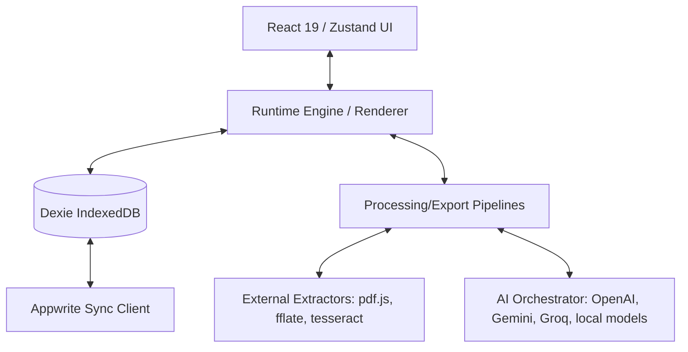

# Software Requirements Specification (SRS) — InfinityCN

**Document Version:** 1.0.0  
**Project Version:** 15.0.0  
**Status:** Approved  
**Target Environment:** Web Browser (Offline-First SPA)

---

## 1. Introduction

### 1.1 Purpose
This document specifies the software requirements for **InfinityCN**, a client-side, offline-first, cinematic storytelling reader. It establishes the functional scope, target environment, performance boundaries, and architectural rules governing the platform.

### 1.2 Scope
InfinityCN is an enhanced reading platform that transforms traditional prose (PDF, EPUB, DOCX, PPTX, TXT) into a screenplay-like cinematic experience. It combines procedural Web Audio, local machine learning embeddings, heuristic text parsing, and cloud-synchronized local database persistence to elevate story immersion.

---

## 2. Overall Description

### 2.1 Product Perspective
InfinityCN operates as a single-page application (SPA) running entirely in the user's browser. It prioritizes local computational power over remote servers, executing heavy operations (OCR, PDF extraction, semantic vector calculation, text-to-screenplay transformation) on the client side.

### 2.2 Product Functions
The core capabilities of InfinityCN include:
1. **Document Import & Extraction:** Parsing text from multi-format files up to 50MB.
2. **Text Processing Pipeline:** Clean, segment chapters, rebuild paragraphs, and map cinematic indicators (SFX, Beat, Ambience, Camera, Emotion/Tension).
3. **Immersive Rendering System:** Dual presentation mode (Original vs. Cinematified) with dynamic layout, glassmorphic themes, and variable pacing transitions.
4. **Procedural Soundscapes:** Adaptive ambient audio generated via Web Audio API, adjusting dynamically to the mapped emotions.
5. **Local Semantic Search:** Vector embeddings created in-browser to establish semantic context and reading continuity.
6. **Multi-Source Story Discovery:** Integrated query matching for external recommendations.
7. **Cloud Synchronization:** Two-way sync with Appwrite, keeping reading state and telemetry up-to-date across devices while Dexie remains the local source of truth.

### 2.3 User Classes and Characteristics
*   **Immersive Readers:** Users seeking high-immersion reading with visual animations and contextual audio cues.
*   **Casual Library Readers:** Users who prefer traditional text views (Library Mode) but utilize smart stats, readability analysis, and discovery tools.
*   **Writers & Content Creators:** Users importing personal drafts and manuscripts to preview them with automated screenplay pacing and narrative arcs.

### 2.4 Design and Implementation Constraints
*   **Client-Side Execution:** The application must remain functional when completely offline (relying on local heuristics, cached assets, and cached AI results).
*   **Memory Efficiency:** PDF rendering and OCR must use Web Workers or deferred imports to prevent blocking the main UI thread.
*   **Security Restrictions:** API keys entered by users must never be sent to third-party tracking services or stored in plain text.

---

## 3. System Interfaces & Target Environment

### 3.1 User Interfaces
*   **App Shell:** Minimal, distraction-free container conforming to the "UI must disappear" rule. Maximum reading container width of ~720px.
*   **Processing Overlay:** A dynamic feedback modal illustrating active pipeline execution stages.
*   **Reader Panel (Theater):** Glassmorphic surface displaying text in high-contrast layouts.
*   **Discovery Sidebar:** Related recommendation listings with badges for source and media type.
*   **Analytics Dashboard:** Visual representation of text metrics, reading progress, and emotion flow.

### 3.2 Hardware & Browser Environment Target
InfinityCN is designed for modern web browsers. It requires support for:
*   **JavaScript Engine:** ESNext (ECMAScript 2026 specifications).
*   **Local Storage:** IndexedDB (minimum allocation of 250MB for book storage).
*   **WebAssembly (WASM):** Required for OCR (Tesseract.js) and local embeddings (@xenova/transformers).
*   **Web Workers:** Multi-threaded handling of heavy extraction jobs.
*   **Web Audio API:** Real-time synthesis of ambient soundscapes.
*   **Service Worker:** PWA caching to allow instant launch under offline conditions.

### 3.3 External API Interfaces
The system connects to several free public endpoints. All external connections must use timeout wrappers (5000ms default) and fall back gracefully to offline defaults:

| API | Purpose | Timeout Behavior |
| :--- | :--- | :--- |
| **Open Library / Google Books** | Book details & metadata enrichment | Fall back to filename and empty metadata |
| **Gutendex** | Free classic book directory | Return empty result list |
| **Jikan (MyAnimeList) / Kitsu** | Anime, Manga, Manhwa, Manhua discovery | Exclude anime/manga recommendations, show local history |
| **Appwrite Client API** | Real-time database sync and remote telemetry | Queue updates in IndexedDB for deferred sync |
| **AI Provider Endpoints** | Cinematification requests (Gemini, Claude, GPT, Groq, Ollama) | Trigger local fallback heuristic processor |

---

## 4. Functional Requirements

### 4.1 Document Parsing & Reconstruction
*   **FR-1.1:** System shall parse PDF (via `pdfjs-dist`), EPUB (via `fflate`), DOCX, PPTX, and TXT files.
*   **FR-1.2:** System shall support scanned PDF extraction through WASM OCR, restricted to the first 5 pages to prevent resource depletion.
*   **FR-1.3:** System shall reconstruct raw text into paragraphs based on selected strategies: sentence clustering, dialogue pivoting, or scene cueing.

### 4.2 Cinematification Engine
*   **FR-2.1:** System shall execute a 7-stage processing pipeline:
    1. Structural Scan (Heading pattern extraction)
    2. Scene Segmentation (Locating scene breaks)
    3. Narrative Analysis (Pacing, readability, sentiment)
    4. Emotion & Tension Mapping (AFINN lexicon analysis)
    5. Character Tracking (Identifying active entities)
    6. Cinematization (Generating SFX, transitions, and audio cues)
    7. Runtime Rendering (Dynamic screen output)
*   **FR-2.2:** System shall generate structured JSON containing all segment markers and render variables. Output must not be plain or loosely formatted text.

### 4.3 Immersive Reading Interface
*   **FR-3.1:** System shall support three immersion levels: Minimal (plain layout), Balanced (transitions and animations), and Cinematic (ambient audio, dramatic pacing, full visual effects).
*   **FR-3.2:** System shall display a live "Cinematic Depth" panel showcasing active metrics: sentence count, cue count, average tension, and dominant emotion.
*   **FR-3.3:** System shall support accessibility variables: Dyslexic typography, custom text size scaling (12px to 28px), line height configurations, and custom layout margins.

---

## 5. Performance Constraints

*   **Max Input File Size:** 50MB. Files exceeding this must be rejected with an informative error modal.
*   **UI Frame Rate:** Transitions, scrolling, and sidebar overlays must maintain a target rate of 60 frames per second (fps) on mid-tier mobile processors.
*   **Processing Latency:** Local heuristic analysis and extraction of a 100k-word manuscript must complete in less than 8 seconds.
*   **Network Request Timeout:** All outbound requests must fail after 5 seconds to avoid locking state hooks.
*   **Memory Footprint:** Heavy WASM models (ONNX runtime) must be garbage-collected or deferred-loaded, keeping active tab memory usage below 500MB.

---

## 6. Security Requirements

*   **Credential Storage:** Never store API keys in plain text inside local storage or settings. All provider API keys must be encrypted client-side using Web Crypto AES-GCM prior to Dexie writes.
*   **No XOR Obfuscation:** Legacy XOR masking is prohibited.
*   **Data Isolation:** All personal reading materials and user telemetry saved in IndexedDB must remain strictly client-side unless cloud sync is explicitly enabled and authorized via Appwrite.
