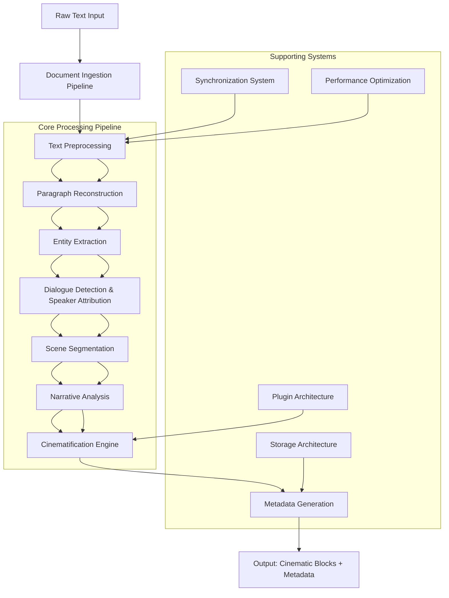

# Cinematification Engine Architecture Document

## Overview

The Cinematification Engine transforms narrative prose into screenplay-style structured output using deterministic, offline NLP techniques. This architecture document details the design of a production-grade system that converts raw text into cinematic blocks while maintaining full traceability and supporting long-form works.

The engine builds upon existing text processing capabilities in the InfinityCN codebase, including document ingestion, text cleaning, entity extraction, paragraph breaking, sentiment analysis, and scene detection, formalizing these components into a cohesive pipeline.

## High-Level Architecture



### Component Interactions

1. **Document Ingestion Pipeline**: Handles file upload, format detection, text extraction, and initial validation
2. **Text Preprocessing**: Applies OCR artifact removal, PDF cleaning, Unicode/quote normalization
3. **Paragraph Reconstruction**: Rebuilds proper paragraph boundaries from hard-wrapped text
4. **Entity Extraction**: Identifies characters and locations using rule-based NLP
5. **Dialogue Detection**: Separates dialogue from narration and attributes speakers
6. **Scene Segmentation**: Detects scene breaks using heuristic patterns (time/location shifts)
7. **Narrative Analysis**: Determines narrative mode (normal/flashback/dream/memory) and POV
8. **Cinematification Engine**: Converts structured text into cinematic blocks with camera directions
9. **Metadata Generation**: Creates scene, character, emotional, and sensory metadata
10. **Storage Architecture**: Persists results in JSON/SQLite formats with vector storage options
11. **Synchronization System**: Maintains offset mappings for traceability between raw and processed text
12. **Performance Optimization**: Implements caching, incremental processing, and parallelization
13. **Plugin Architecture**: Allows extensibility for custom cinematification rules

## Detailed Processing Pipeline

### Stage 1: Document Ingestion
- **Input**: File (PDF, DOCX, EPUB, PPTX, TXT)
- **Process**: 
  - Format detection and validation
  - Text extraction with OCR fallback
  - Corrupted file recovery
  - Multi-stage progress reporting
  - Quality gates between stages
- **Output**: Cleaned text with ingestion metadata

### Stage 2: Text Preprocessing
- **OCR Artifact Removal**: 
  - Stray diacritical marks removal
  - Multi-space normalization inside words
  - Hyphenated line break repair
  - Tab and form feed normalization
  - Control character filtering
- **PDF Artifact Removal**: 
  - Page number/header/footer removal
  - Excessive whitespace normalization
  - Repeated character line filtering
- **Unicode Normalization**: NFC normalization and ligature expansion
- **Quote Normalization**: Smart quotes to straight quotes, dash standardization

### Stage 3: Paragraph Reconstruction
- **Whitespace Normalization**: Line ending and spacing standardization
- **Boundary Detection**: 
  - Sentence boundary detection with abbreviation handling
  - Poetry/verse detection (short lines preserved)
  - All-caps heading detection
- **Line Merging**: 
  - Hyphenated word reconstruction
  - Sentence continuation detection
  - Dialogue-start driven breaks
- **Paragraph Grouping**: 
  - Sentence clustering with budget constraints
  - Dialogue-pivot and scene-cue strategies
  - Confidence-based selection

### Stage 4: Entity Extraction
- **Character Detection** (using Compromise.js):
  - Person entity identification
  - Noise filtering (pronouns, single letters)
  - Alias resolution and canonicalization
  - Appearance counting
- **Location Detection**:
  - Place entity identification
  - Capitalization normalization
  - First mention tracking
- **Output**: Character and location registries with metadata

### Stage 5: Dialogue Detection & Speaker Attribution
- **Quote Detection**: Regex-based quotation mark identification
- **Speaker Attribution**:
  - Trailing/leading attribution patterns ("John said", "said John")
  - Speech verb dictionary (said, whispered, shouted, etc.)
  - Name pattern matching (capitalized names)
  - Pronoun handling (I, he, she, they, we)
- **Action Beat Detection**: 
  - Physical action identification between dialogue
  - Tension scoring integration
- **Output**: Paragraphs with structured fragments (dialogue/narration/action_beat)

### Stage 6: Scene Segmentation
- **Heuristic Break Detection**:
  - Time shifts (hours later, the next morning)
  - Location changes (at the Castle, in the forest)
  - Narrative transitions (meanwhile, elsewhere)
  - Character POV changes
  - Emotional resets (sentiment polarity flip)
  - Structural dividers (***, ---, etc.)
- **Scene Grouping**: Paragraph clustering based on break signals
- **Title Derivation**: 
  - Location-based titles ("The Castle")
  - Time-based titles ("Dawn")
  - Action-based titles ("The Chase")
  - Mood-based titles ("Suspenseful Scene")
  - POV-based titles ("John's Scene")
- **Output**: Scenes with titles and paragraph assignments

### Stage 7: Narrative Analysis
- **Mode Detection**:
  - Flashback patterns ("years earlier", "flashback")
  - Dream patterns ("dream sequence", "dream")
  - Memory patterns ("remembered", "recalled")
  - Default to normal mode
- **POV Tracking**:
  - Character name detection at scene start
  - Pronoun resolution
  - Consistency tracking across scenes
- **Sentiment Analysis**: 
  - Scene-level sentiment scoring (-1 to 1)
  - Emotional trajectory tracking
- **Output**: Narrative mode and POV per scene

### Stage 8: Cinematification Engine
- **Block Type Classification**:
  - Action: Descriptive narrative
  - Dialogue: Character speech
  - Inner Thought: Character internal monologue
  - SFX: Sound effect annotations
  - Beat: Dramatic pauses/tension
  - Transition: Scene changes
  - Title Card: Chapter/scene headers
  - Chapter Header: Structural markers
- **Camera Angle Direction** (MockDirector):
  - Wide shots for transitions/titles
  - Close-ups for high tension/dialogue shifts
  - Over-the-shoulder for dialogue
  - POV for character perspective
  - Tracking shots for action sequences
- **Transition Selection**:
  - CUT TO for standard changes
  - DISSOLVE TO for flashbacks/dreams
  - SMASH CUT for high tension shifts
  - FADE IN/OUT for chapter/scene boundaries
- **Intensity & Timing**:
  - Based on dialogue punctuation (! for emphasis, ... for whisper)
  - Question frequency for suspense timing
  - Sentence length for pacing
- **Tension Tracking**:
  - Lexicon-based arousal calculation (kill=+15, smile=-10)
  - Decay-based smoothing
  - Emotion mapping from tension levels
- **Ambience Engine**:
  - Environmental soundscapes (rain, wind, forest, etc.)
  - Tension-based ambience selection
- **Speaker Attribution**:
  - Scene-based speaker tracking
  - Alternating speaker assignment
  - Explicit attribution override
- **Output**: Structured cinematic blocks with metadata

### Stage 9: Metadata Generation
- **Scene Metadata**:
  - Title and unique ID
  - Word count and paragraph count
  - Narrative mode and POV character
  - Sentiment score and break reason
  - Associated characters and locations
- **Character Metadata**:
  - Name and canonical aliases
  - Appearance count per scene/chapter
  - First and last mention tracking
- **Location Metadata**:
  - Normalized name format
  - Appearance count and first mention
- **Emotional Metadata**:
  - Dominant emotion per block/scene
  - Tension score (0-100)
  - Sentiment trajectory
- **Sensory Metadata**:
  - Ambience type (from Ambience Engine)
  - SFX annotations
  - Beat descriptions

### Stage 10: Storage Architecture
- **Primary Format**: JSON for human-readability and debugging
  - Structured narrative document with all metadata
  - Cinematic blocks array with rich properties
  - Entity registries and scene indices
- **Secondary Format**: SQLite for querying and analytics
  - Normalized schema for efficient querying
  - Full-text search capabilities
  - Transactional updates for large works
- **Vector Storage** (optional):
  - Semantic embedding storage for similarity search
  - Enable thematic analysis and motif detection
  - Integration with existing embedding pipelines
- **Backup & Versioning**:
  - Incremental savepoints for long-form works
  - Change tracking and rollback capability
  - Export formats (Final Draft, Fountain, PDF)

### Stage 11: Synchronization System
- **Offset Mapping**:
  - Character-level mapping between raw and processed text
  - Enables traceability for editing and review
  - Supports round-trip transformations
- **Alignment Tracking**:
  - Paragraph and sentence alignment records
  - Handles insertions/deletions during processing
  - Maintains structural integrity
- **Change Propagation**:
  - Local updates trigger reprocessing of affected regions
  - Minimal re-processing for efficiency
  - Conflict resolution for concurrent edits

### Stage 12: Performance Optimization
- **Memory Management**:
  - Streaming processing for large documents
  - Chunk-based processing with overlap
  - Garbage collection optimization
- **Caching Strategy**:
  - LRU caches for expensive operations (readability, sentiment, pacing)
  - Key-based on text content hash
  - Configurable size limits with LRU eviction
- **Parallel Processing**:
  - Independent analytics stages run in parallel
  - Pipeline parallelization for multi-chapter works
  - Worker pool for CPU-intensive operations
- **Incremental Processing**:
  - Change detection avoids full reprocessing
  - Checkpointing for interruption recovery
  - Selective stage re-execution based on dependencies

### Stage 13: Plugin Architecture
- **Extension Points**:
  - Custom entity recognition patterns
  - Alternative cinematification rules
  - Additional metadata generators
  - Custom output formatters
- **Interface Definition**:
  - Standardized data contracts between stages
  - Versioned APIs for backward compatibility
  - Registration and discovery mechanism
- **Isolation & Safety**:
  - Sandboxed execution for untrusted plugins
  - Resource limits and timeout protection
  - Fallback to built-in implementations

## NLP Component Design

### Core Techniques Used
1. **Rule-Based Pattern Matching** (Primary):
   - Regex patterns for structural detection
   - Dictionary-based lookups (lexicons, verb lists)
   - Syntactic heuristics (attachment, coordination)
2. **Statistical Methods** (Limited):
   - Frequency-based alias resolution
   - Co-occurrence statistics for entity disambiguation
3. **Language Resources**:
   - Compromise.js for lightweight NLP
   - Custom lexicons for emotion, SFX, and tension
   - Built-in abbreviation and speech verb dictionaries

### Specific Component Designs

**TextCleaning Component**:
- Deterministic artifact removal pipeline
- Ordered application of cleaning stages
- Configurable aggressiveness levels

**ParagraphReconstructor**:
- Multi-strategy approach with confidence scoring
- Preserves intentional formatting (poetry, headings)
- Recovers from OCR and PDF extraction artifacts

**EntityExtractor (Compromise.js wrapper)**:
- Pipeline: Tokenization → POS tagging → Chunking → Entity recognition
- Post-processing: Noise filtering, canonicalization, alias resolution
- Extensible through custom patterns and filters

**DialogueDetector**:
- Quote boundary detection with nesting awareness
- Context window analysis for speaker attribution
- Verb-based confidence scoring
- Action beat isolation between dialogue fragments

**SceneSegmenter**:
- Multi-signal weighted voting system
- Configurable break sensitivity thresholds
- Hierarchical break detection (strong→weak signals)
- Fallback to structural-only segmentation

**NarrativeAnalyzer**:
- Pattern-based mode detection with confidence weighting
- POV tracking through noun phrase analysis
- Sentiment flow analysis using lexicon-based scoring
- Temporal consistency enforcement

**CinematificationEngine**:
- Rule-based block classification with fallback
- Tension-driven camera and timing decisions
- Deterministic randomization for variation (seeded)
- Extensible through plugin architecture

## Scene Detection System

### Deterministic Algorithms
The scene detection system uses hierarchical heuristic patterns without machine learning:

1. **Strong Breaks** (Definitive scene changes):
   - Structural dividers: `***`, `---`, `___`
   - Explicit markers: `SCENE BREAK`, `CHAPTER`
   - Format markers: `INT.`, `EXT.` (screenplay format)

2. **Medium Breaks** (Likely scene changes):
   - Time shifts: `hours later`, `the next morning`, `meanwhile`
   - Location shifts: `at the Castle`, `in the forest`
   - Narrative transitions: `elsewhere`, `back at`
   - Emotional resets: Sentiment polarity flip (>0.55 delta)

3. **Weak Breaks** (Possible scene changes):
   - Paragraph density thresholds (>8 paragraphs)
   - POV shifts (character name changes)
   - Mode transitions (flashback→dream→memory)

### Pseudocode for Scene Detection
```javascript
function detectSceneBreaks(paragraphs) {
    const scenes = [];
    let currentScene = [];
    let breakScore = 0;
    
    for (let i = 0; i < paragraphs.length; i++) {
        const para = paragraphs[i].trim();
        if (!para) continue;
        
        // Reset score for structural elements
        if (isStructuralDivider(para)) {
            if (currentScene.length > 0) {
                scenes.push(currentScene);
                currentScene = [];
            }
            continue;
        }
        
        // Calculate break signals
        let signalScore = 0;
        signalScore += timeShiftScore(para) * 2;      // 0-4
        signalScore += locationShiftScore(para) * 2;  // 0-4
        signalScore += narrativeTransitionScore(para) * 2; // 0-4
        signalScore += povShiftScore(para, i-1) * 2;  // 0-4
        signalScore += emotionalResetScore(para, i-1) * 2; // 0-4
        signalScore += structuralDividerScore(para) * 3; // 0-6
        
        // Apply paragraph limit break
        if (currentScene.length >= MAX_PARAGRAPHS_PER_SCENE && signalScore >= 1) {
            signalScore = Math.max(signalScore, BREAK_THRESHOLD);
        }
        
        // Check if break threshold exceeded
        if (signalScore >= BREAK_THRESHOLD) {
            if (currentScene.length > 0) {
                scenes.push(currentScene);
                currentScene = [];
            }
        }
        
        currentScene.push(para);
    }
    
    // Add final scene
    if (currentScene.length > 0) {
        scenes.push(currentScene);
    }
    
    return scenes.map((scene, index) => ({
        id: `scene-${index + 1}`,
        text: scene.join('\n\n'),
        title: deriveSceneTitle(scene, index + 1)
    }));
}
```

### Supporting Functions
- **timeShiftScore()**: Returns 0-2 based on time shift pattern strength
- **locationShiftScore()**: Returns 0-2 based on location change detection
- **narrativeTransitionScore()**: Returns 0-2 for transition words/phrases
- **povShiftScore()**: Returns 0-2 if POV character changes between paragraphs
- **emotionalResetScore()**: Returns 0-2 based on sentiment delta and polarity flip
- **structuralDividerScore()**: Returns 0-3 for divider pattern matches

### Scene Title Derivation Hierarchy
1. Explicit location mention in first sentence
2. Explicit time mention in first sentence  
3. Opening action phrase ("The Chase", "The Conversation")
4. Mood-based from scene-wide analysis ("Suspenseful Scene")
5. POV-based if consistent character ("John's Scene")
6. Default numbering ("Scene 5")

## Dialogue Attribution System

### Rules for Attribution
The system uses a multi-pass approach to speaker attribution:

1. **Explicit Attribution** (Highest Confidence):
   - Pattern: `[Name] [speech verb]` or `[speech verb] [Name]`
   - Examples: "John said", "said Sarah", "whispered Michael"
   - Validation: Name pattern matching, verb dictionary lookup

2. **Implicit Attribution** (Medium Confidence):
   - Pattern: Dialogue followed by action/description with named subject
   - Examples: 
     - `"Hello." John waved.` → John
     - `She laughed. "That's funny."` → She (from previous context)
   - Window: 180 characters before/after dialogue

3. **Continuation Attribution** (Context-Based):
   - Alternating speaker assignment in dialogue sequences
   - Scene-based speaker tracking resets
   - Known character list from entity extraction

4. **Fallback Attribution** (Lowest Confidence):
   - Pronoun resolution within local context
   - Gender agreement checking
   - Assign to most recent speaker in scene

### Handling Multi-Speaker Scenarios
- **Two-Character Scenes**: Strict alternation after establishment
- **Three+ Character Scenes**: 
  - Require explicit attribution every 2-3 exchanges
  - Use contextual clues (addressing, action bids)
  - Fallback to most linguistically salient speaker
- **Group Dialogue**: 
  - Mark as ensemble when 4+ speakers detected
  - Preserve individual attributions when possible
  - Use "GROUP" speaker tag when unattributable

### Confidence Scoring
Each attribution receives a confidence score:
- Explicit match with known character: 0.95
- Explicit match with unknown name: 0.8
- Implicit from action bid: 0.7
- Continuation in alternating pattern: 0.6
- Pronoun resolution: 0.5
- Fallback to scene default: 0.3

### Special Cases Handled
- **Internal Monologue**: Detected via introspective patterns, marked as `inner_thought`
- **Narrated Speech**: Indirect speech preserved as narration with attribution note
- **Unclear Attribution**: Marked with `speaker: null` and low intensity
- **Non-Verbal Sounds**: Laughter, screams processed as SFX or action_beat

## Metadata Generation System

### Scene-Level Metadata
```typescript
interface SceneMetadata {
    id: string;                    // UUID or sequential ID
    title: string;                 // Derived scene title
    index: number;                 // Scene sequence number
    wordCount: number;             // Total words in scene
    paragraphCount: number;        // Paragraph count
    narrativeMode: 'normal' | 'flashback' | 'dream' | 'memory';
    povCharacter?: string;         // POV character if detected
    sentimentScore: number;        // -1 to 1 aggregate sentiment
    breakReason: SceneBreakReason; // Why this scene started
    tensionProfile: number[];      // Per-block tension scores
    dominantEmotion: EmotionCategory;
    characters: string[];          // Character names appearing
    locations: string[];           // Location names appearing
    ambience: string;              // From Ambience Engine
    sfxCount: number;              // Sound effect count
    beatCount: number;             // Dramatic beat count
}
```

### Character-Level Metadata
```typescript
interface CharacterMetadata {
    name: string;                  // Canonical name
    aliases: string[];             // Alternative names/references
    firstAppearance: {
        sceneIndex: number;
        paragraphIndex: number;
        offset: number;
    };
    lastAppearance: {
        sceneIndex: number;
        paragraphIndex: number;
        offset: number;
    };
    appearanceCount: number;       // Total mentions
    scenePresence: number[];       // Scenes where character appears
    dialoguePercentage: number;    // % of dialogue spoken by character
    emotionalArc: EmotionCategory[]; // Dominant emotion per appearance
    relationshipTags: string[];    // Derived relationships (protagonist, antagonist, etc.)
}
```

### Location-Level Metadata
```typescript
interface LocationMetadata {
    name: string;                  // Normalized location name
    firstAppearance: {
        sceneIndex: number;
        paragraphIndex: number;
        offset: number;
    };
    appearanceCount: number;
    scenePresence: number[];       // Scenes where location appears
    associatedCharacters: string[]; // Characters frequently at location
    atmosphereTags: string[];      // Derived mood (dark, cheerful, tense, etc.)
    geographicType: string;        // city, forest, building, etc. (if detectable)
}
```

### Emotional & Sensory Metadata
```typescript
interface EmotionalMetadata {
    tensionScore: number;          // 0-100 per block/scene
    emotion: EmotionCategory;      // From TensionTracker or sentiment
    sentiment: number;             // -1 to 1 sentiment score
    arousal: number;               // Excitement/calm dimension
    valence: number;               // Positive/negative dimension
}

interface SensoryMetadata {
    ambience: string;              // Environmental soundscape
    sfx: SFXAnnotation[];          // Sound effects with intensity
    lighting: string;              // Derived from context (dark, bright, etc.)
    weather: string;               // Derived from context (rain, sun, etc.)
    temperature: string;           // Derived (hot, cold, warm, etc.)
    internalSensations: string[];  // Heartbeat, breath, etc. from text
}
```

## Storage Architecture

### JSON Storage Format
Primary human-readable and debuggable format:
```json
{
    "version": "1.0.0",
    "metadata": {
        "title": "Document Title",
        "author": "Unknown",
        "wordCount": 50000,
        "sceneCount": 120,
        "processingTimeMs": 2500,
        "createdAt": "2026-06-14T10:30:00Z"
    },
    "narrativeDocument": {
        "originalText": "...",
        "cleanedText": "...",
        "processedText": "...",
        "paragraphs": [
            {
                "index": 0,
                "text": "...",
                "wordCount": 25,
                "hasDialogue": true,
                "isHeading": false,
                "fragments": [
                    { "type": "dialogue", "content": "...", "speaker": "JOHN", "verb": "said" },
                    { "type": "narration", "content": "..." }
                ]
            }
        ],
        "scenes": [
            {
                "id": "scene-1",
                "title": "The Castle",
                "text": "...",
                "wordCount": 450,
                "paragraphCount": 8,
                "narrativeMode": "normal",
                "povCharacter": "JOHN",
                "sentimentScore": 0.2,
                "breakReason": "start",
                "paragraphs": [0, 1, 2, 3, 4, 5, 6, 7]
            }
        ]
    },
    "cinematicBlocks": [
        {
            "id": "block-001",
            "type": "title_card",
            "content": "THE CASTLE",
            "intensity": "emphasis",
            "tensionScore": 10
        },
        {
            "id": "block-002",
            "type": "transition",
            "content": "",
            "transition": { "type": "FADE IN" },
            "intensity": "normal"
        },
        {
            "id": "block-003",
            "type": "action",
            "content": "JOHN entered the castle gates.",
            "intensity": "normal",
            "speaker": "JOHN",
            "emotion": "neutral",
            "tensionScore": 20,
            "entities": {
                "characters": ["JOHN"],
                "locations": ["CASTLE"]
            }
        }
    ],
    "entityRegistries": {
        "characters": [
            {
                "name": "JOHN",
                "aliases": ["JONATHAN", "JACK"],
                "appearanceCount": 45,
                "firstAppearance": { "sceneIndex": 0, "paragraphIndex": 0 }
            }
        ],
        "locations": [
            {
                "name": "CASTLE",
                "appearanceCount": 12,
                "firstAppearance": { "sceneIndex": 0, "paragraphIndex": 2 }
            }
        ]
    },
    "synchronization": {
        "offsetMap": [
            { "originalOffset": 0, "processedOffset": 0, "length": 15 },
            { "originalOffset": 15, "processedOffset": 17, "length": 8 }
        ],
        "alignment": {
            "paragraphs": [{ "original": 0, "processed": 0, "confidence": 0.95 }],
            "sentences": [{ "original": 0, "processed": 0, "confidence": 0.9 }]
        }
    }
}
```

### SQLite Schema
For efficient querying and analytics:
```sql
-- Documents table
CREATE TABLE documents (
    id INTEGER PRIMARY KEY,
    title TEXT,
    author TEXT,
    created_at TIMESTAMP,
    word_count INTEGER,
    processing_time_ms INTEGER
);

-- Scenes table
CREATE TABLE scenes (
    id INTEGER PRIMARY KEY,
    document_id INTEGER,
    scene_index INTEGER,
    title TEXT,
    word_count INTEGER,
    paragraph_count INTEGER,
    narrative_mode TEXT, -- 'normal'|'flashback'|'dream'|'memory'
    pov_character TEXT,
    sentiment_score REAL,
    break_reason TEXT,
    FOREIGN KEY (document_id) REFERENCES documents(id)
);

-- Characters table
CREATE TABLE characters (
    id INTEGER PRIMARY KEY,
    document_id INTEGER,
    name TEXT UNIQUE,
    first_scene INTEGER,
    first_paragraph INTEGER,
    first_offset INTEGER,
    last_scene INTEGER,
    last_paragraph INTEGER,
    last_offset INTEGER,
    appearance_count INTEGER,
    FOREIGN KEY (document_id) REFERENCES documents(id)
);

-- Character appearances (many-to-many with scenes)
CREATE TABLE character_appearances (
    id INTEGER PRIMARY KEY,
    character_id INTEGER,
    scene_id INTEGER,
    paragraph_index INTEGER,
    offset_in_paragraph INTEGER,
    FOREIGN KEY (character_id) REFERENCES characters(id),
    FOREIGN KEY (scene_id) REFERENCES scenes(id)
);

-- Locations table (similar to characters)
CREATE TABLE locations (
    id INTEGER PRIMARY KEY,
    document_id INTEGER,
    name TEXT UNIQUE,
    first_scene INTEGER,
    first_paragraph INTEGER,
    first_offset INTEGER,
    last_scene INTEGER,
    last_paragraph INTEGER,
    last_offset INTEGER,
    appearance_count INTEGER,
    FOREIGN KEY (document_id) REFERENCES documents(id)
);

-- Cinematic blocks table
CREATE TABLE cinematic_blocks (
    id INTEGER PRIMARY KEY,
    document_id INTEGER,
    block_index INTEGER,
    type TEXT, -- 'action'|'dialogue'|'inner_thought'|'sfx'|'beat'|'transition'|'title_card'|'chapter_header'
    content TEXT,
    speaker TEXT,
    intensity TEXT, -- 'whisper'|'normal'|'emphasis'|'shout'|'explosive'
    emotion TEXT, -- 'neutral'|'suspense'|'action'| etc.
    tension_score INTEGER,
    timing TEXT, -- 'slow'|'normal'|'quick'|'rapid'
    FOREIGN KEY (document_id) REFERENCES documents(id)
);

-- Block entities (many-to-many)
CREATE TABLE block_entities (
    id INTEGER PRIMARY KEY,
    block_id INTEGER,
    entity_type TEXT, -- 'character'|'location'
    entity_value TEXT,
    FOREIGN KEY (block_id) REFERENCES cinematic_blocks(id)
);

-- Synchronization offset map
CREATE TABLE offset_map (
    id INTEGER PRIMARY KEY,
    document_id INTEGER,
    original_offset INTEGER,
    processed_offset INTEGER,
    length INTEGER,
    FOREIGN KEY (document_id) REFERENCES documents(id)
);

-- Indexes for performance
CREATE INDEX idx_scenes_document ON scenes(document_id);
CREATE INDEX idx_characters_document ON characters(document_id);
CREATE INDEX idx_locations_document ON locations(document_id);
CREATE INDEX idx_blocks_document ON cinematic_blocks(document_id);
CREATE INDEX idx_offset_map_document ON offset_map(document_id);
```

### Vector Storage Integration (Optional)
For semantic analysis capabilities:
- Collection per document for paragraph/scene embeddings
- Metadata filtering by scene, character, emotion
- Similarity search for thematic analysis
- Clustering for motif detection
- Integration with existing embedding services (local models preferred)

## Synchronization System

### Offset Mapping Mechanism
The system maintains bi-directional mapping between raw input and processed output:

1. **Character-Level Mapping**:
   - Tracks every character's position transformation
   - Handles insertions, deletions, and substitutions
   - Uses sequence alignment algorithms (Needleman-Wunsch variants)

2. **Structure-Preserving Alignment**:
   - Paragraph boundaries mapped with high confidence
   - Sentence boundaries tracked for granular operations
   - Whitespace normalization tracked separately

3. **Change Propagation**:
   - Local edits trigger re-processing of affected regions
   - Dependency tracking determines minimal re-processing needed
   - Checkpointing enables rollback and versioning

### Data Structures
```typescript
interface OffsetMapping {
    originalStart: number;   // Offset in raw text
    originalEnd: number;     // End offset in raw text
    processedStart: number;  // Offset in processed text
    processedEnd: number;    // End offset in processed text
    confidence: number;      // 0-1 mapping confidence
    operation: 'match' | 'insert' | 'delete' | 'substitute';
}

interface SynchronizationData {
    offsetMap: OffsetMapping[];           // Character-level mapping
    paragraphAlignment: {                 // Paragraph-to-paragraph
        originalIndex: number;
        processedIndex: number;
        confidence: number;
    }[];
    sentenceAlignment: {                  // Sentence-to-sentence
        originalIndex: number;
        processedIndex: number;
        confidence: number;
    }[];
    version: string;                      // For change tracking
    checkpointId?: string;                // For rollback capability
}
```

### Update Processing Workflow
1. **Change Detection**: Compare new raw text with stored version
2. **Impact Analysis**: Identify affected processing stages
3. **Selective Re-processing**:
   - Text changes before paragraph reconstruction: Full re-process from start
   - Changes within paragraphs: Re-process affected paragraphs only
   - Metadata-only updates: Regenerate derived data from existing blocks
4. **Merge Results**: Combine unchanged and newly processed sections
5. **Update Synchronization**: Refresh offset maps and alignments
6. **Notify Dependencies**: Update dependent systems (storage, UI, analytics)

## Performance Optimization

### Memory Management Strategies
- **Streaming Processing**: Process documents in chunks with overlap buffers
- **Object Pooling**: Reuse common objects (buffers, temporary strings)
- **Lazy Loading**: Load large resources (lexicons, models) on demand
- **Garbage Collection Hints**: Explicit nulling for large temporary structures
- **Chunk Sizing**: Dynamic chunk size based on document characteristics and available memory

### Caching Architecture
- **Multi-Level Caching**:
  - L1: In-process LRU for expensive computations (readability, sentiment)
  - L2: File-based cache for persistence across sessions (optional)
  - L3: Pre-computed shared resources (lexicons, dictionaries)
- **Cache Keying**: Content-based hashing with versioning
- **Invalidation Strategies**:
  - Time-based TTL for volatile data
  - Content-based invalidation for data dependencies
  - Manual flush for configuration changes
- **Size Management**: Configurable limits with LRU/LFU eviction policies

### Parallel Processing Opportunities
- **Pipeline Parallelism**: Different chunks at different stages
- **Data Parallelism**: Independent analytics on different scenes/paragraphs
- **Task Parallelism**: 
  - Readability, sentiment, pacing, and text statistics analysis
  - Entity extraction and cinematification (separate pipelines)
  - Metadata generation and storage operations
- **Worker Pool Management**: 
  - Dynamic sizing based on CPU cores and workload
  - Affinity scheduling for cache efficiency
  - Work stealing for load balancing

### Incremental Processing Techniques
- **Dependency Tracking**: 
  - Build DAG of processing stage dependencies
  - Track which stages depend on which outputs
  - Memoize intermediate results with content hashes
- **Change Propagation**:
  - Character-level change detection using rolling hashes
  - Structural change detection (paragraph/scene boundaries)
  - Semantic change detection for metadata updates
- **Checkpointing System**:
  - Automatic checkpoints at stage boundaries
  - Manual checkpoints for user-defined save points
  - Fast recovery from interruptions or errors

## Plugin Architecture

### Extension Interface Definition
```typescript
// Core data contracts
interface PluginContext {
    documentId: string;
    stage: string;  // Current pipeline stage
    config: Record<string, any>;
    logger: PluginLogger;
    cancelToken: AbortSignal;
}

interface PluginResult<T> {
    success: boolean;
    data?: T;
    error?: string;
    metadata?: Record<string, any>;
}

// Extension points
interface EntityRecognizerPlugin {
    initialize(context: PluginContext): Promise<void>;
    extractEntities(text: string): Promise<PluginResult<ExtractedEntities>>;
    shutdown(): Promise<void>;
}

interface CinematificationRulePlugin {
    initialize(context: PluginContext): Promise<void>;
    classifyBlock(fragment: TextFragment, context: PluginContext): 
        Promise<PluginResult<CinematicBlockType>>;
    enhanceBlock(block: CinematicBlock, context: PluginContext): 
        Promise<PluginResult<CinematicBlock>>;
    shutdown(): Promise<void>;
}

interface MetadataGeneratorPlugin {
    initialize(context: PluginContext): Promise<void>;
    generateMetadata(blocks: CinematicBlock[], context: PluginContext):
        Promise<PluginResult<Record<string, any>>>;
    shutdown(): Promise<void>;
}

interface OutputFormatterPlugin {
    initialize(context: PluginContext): Promise<void>;
    formatResult(result: CinematificationResult, context: PluginContext):
        Promise<PluginResult<string | Blob>>;
    shutdown(): Promise<void>;
}

// Plugin registry and lifecycle
interface PluginManager {
    registerPlugin<T>(type: string, plugin: T): Promise<void>;
    getPlugins<T>(type: string): Promise<T[]>;
    executePluginStage<T>(stage: string, input: any): 
        Promise<PluginResult<any>>;
    shutdownAll(): Promise<void>;
}
```

### Sandboxing and Security
- **Process Isolation**: Plugins run in separate processes or workers
- **Resource Limits**: 
  - Memory usage caps per plugin
  - CPU time quotas
  - File system access restrictions
- **API Restriction**:
  - Whitelisted Node.js/browser APIs
  - No network access by default (opt-in with permissions)
  - No filesystem access outside designated temp directories
- **Communication**: 
  - Message-passing interface (structured cloning)
  - Transferable objects for large data efficiency
  - Timeout and deadlock detection

### Plugin Discovery and Loading
- **Manifest Format**:
  ```json
  {
    "name": "custom-emotion-detector",
    "version": "1.0.0",
    "description": "Custom emotion detection based on domain-specific lexicon",
    "main": "./dist/plugin.js",
    "extends": ["metadata-generator"],
    "engines": { "cinematification-engine": ">=1.0.0" },
    "permissions": ["file-read", "network-limited"],
    "configSchema": {
      "lexiconPath": "string",
      "confidenceThreshold": {"minimum": 0, "maximum": 1}
    }
  }
  ```
- **Loading Process**:
  1. Manifest validation and permission checking
  2. Dependency resolution and version checking
  3. Sandbox environment preparation
  4. Module loading and initialization
  5. Health check and readiness signaling
- **Hot Reloading** (Development Only):
  - File watching for manifest and source changes
  - Graceful shutdown and restart of affected plugins
  - State preservation where possible
  - Fallback to previous version on load failure

## Technology Recommendations

### Primary Language/Platform Selection
**Recommended: TypeScript / Node.js (with browser-compatible core)**

**Justification**:
- Existing codebase maturity and team expertise
- Excellent NLP library ecosystem (Compromise.js, natural, franc-min)
- Strong text processing capabilities (Unicode, regex, streaming)
- Cross-platform compatibility (desktop, server, embedded)
- Rich plugin ecosystems and module systems
- Strong typing catches NLP edge cases at compile time
- Async/await for clean pipeline orchestration
- V8 engine performance for text processing workloads

**Alternatives Considered**:
- **Python**: Rejected due to existing TS/JS codebase and client-side requirements
- **Rust**: Rejected due to longer development time despite performance benefits
- **Go**: Rejected due to weaker text processing ecosystem for NLP tasks
- **Java/JVM**: Rejected due to memory overhead and startup time

### Core Framework Dependencies
1. **Compromise.js**: 
   - Lightweight NLP for POS tagging, chunking, entity extraction
   - Bundle size ~50kb gzipped
   - Well-maintained, TypeScript definitions available
   - Alternative: wink-nlp (similar features, different API)

2. **Lodash/Underscore**:
   - Utility functions for collections, strings, objects
   - Tree-shakable imports for bundle optimization
   - Alternative: native JS + selective polyfills

3. **Async/Microtask Utilities**:
   - Promise pooling and cancellation tokens
   - Alternative: manual promise management or RxJS

4. **Testing Framework**:
   - Jest for unit and integration testing
   - Alternative: Vitest (faster, ESM-native)
   - End-to-end: Playwright or Cypress

### Database/Storage Recommendations
1. **Primary**: 
   - JSON files for development/debugging and small documents
   - SQLite for production and large works (>50k words)
   - Reason: Zero-config, ACID transactions, full-text search, portability

2. **Optional Vector Storage** (for advanced analytics):
   - Local: TensorFlow.js embeddings or ONNX Runtime models
   - Remote: Only if existing infrastructure available and privacy permits
   - Alternative: SQLite with FTS5 for basic text search

### Build and DevOps Tooling
- **Build System**: 
  - ESBuild or Vite for fast bundling
  - Alternative: Webpack for complex code splitting needs
- **Package Management**:
  - npm/yarn/pnpm (match existing codebase)
- **CI/CD**:
  - GitHub Actions for automated testing and deployment
  - Containerization with Docker for consistent environments
- **Monitoring**:
  - Application metrics collection (processing time, memory usage)
  - Error tracking and alerting
  - Performance benchmarking suite

### Cross-Platform Considerations
- **Desktop**: 
  - Electron wrapper for existing web technologies
  - Alternative: Taurus for smaller bundle and better security
- **Mobile**:
  - Progressive Web App with offline capabilities
  - Alternative: React Native for native performance (if needed)
- **Web**:
  - Standard SPA with service workers for offline
  - Worker threads for CPU-intensive processing
- **Embedded/IoT**:
  - Node.js on Raspberry Pi or similar SBC
  - Optimized builds with stripped dependencies

## Project Structure

```
infinitycn/
├── docs/
│   ├── CINEMATIFICATION_ARCHITECTURE.md   ← This document
│   ├── user-testing-checklist.md
│   └── wireframes.md
├── src/
│   ├── components/                        # UI components (React)
│   │   ├── reader/                        # Reader-specific components
│   │   ├── layout/                        # Layout and navigation
│   │   ├── ui/                            # Shared UI components
│   │   └── features/                      # Feature-specific components
│   ├── lib/
│   │   ├── processing/                    # Document ingestion and text stats
│   │   │   ├── documentIngestion.ts       # File → Text pipeline
│   │   │   ├── textStatistics.ts          # Text analytics
│   │   │   └── ...                        # PDF worker, job queue, etc.
│   │   ├── engine/
│   │   │   └── cinematifier/              # Core cinematification engine
│   │   │       ├── textProcessing.ts      # Text cleaning & paragraph rebuild
│   │   │       ├── entityExtractor.ts     # NER using Compromise.js
│   │   │       ├── sceneDetection.ts      # Heuristic scene break detection
│   │   │       ├── sentimentTracker.ts    # Sentiment analysis
│   │   │       ├── moodLexicon.ts         # Emotion and SFX lexicons
│   │   │       ├── pacingAnalyzer.ts      # Text pacing analysis
│   │   │       ├── readability.ts         # Readability metrics
│   │   │       ├── offlineEngine.ts       # Fallback cinematification
│   │   │       ├── pipeline.ts            # Composable pipeline engine
│   │   │       ├── chapterEngine.ts       # Chapter-level entrypoint
│   │   │       ├── fullSystemPipeline.ts  # End-to-end processing
│   │   │       ├── types/                 # TypeScript interfaces
│   │   │       │   ├── cinematifier.ts    # Cinematic block types
│   │   │       │   ├── book.ts            # Book/chapter types
│   │   │       │   ├── reader.ts          # Reader state types
│   │   │       │   ├── rendering.ts       # Rendering pipeline types
│   │   │       │   ├── emotion.ts         # Emotion categories
│   │   │       │   └── processing.ts      # Processing options/types
│   │   │       ├── utils/                 # Shared utilities
│   │   │       │   ├── regexPatterns.ts   # Centralized regex constants
│   │   │       │   └── ...                # Helper functions
│   │   │       └── index.ts               # Public exports
│   │   ├── runtime/                       # Platform adapters and services
│   │   │   ├── renderer.ts                # Render plan builder
│   │   │   ├── cinematifiedCache.ts       # Client-side caching
│   │   │   ├── bookManager.ts             # Book-level operations
│   │   │   ├── readerBackend.ts           # Reader data management
│   │   │   ├── writeApis/                 # Output format generators
│   │   │   └── ...                        # Runtime services
│   │   ├── hooks/                         # React custom hooks
│   │   ├── store/                         # State management (Zustand/Redux)
│   │   ├── types/                         # Shared TypeScript types
│   │   └── __tests__/                     # Test suites
│   ├── public/                            # Static assets
│   └── styles/                            # CSS and styling
├── .planning/                             # GSD planning artifacts
├── package.json                           # Dependencies and scripts
├── tsconfig.json                          # TypeScript configuration
└� README.md                                # Project overview
```

## Development Roadmap

### Phase 1: Foundation and Core Pipeline (Weeks 1-3)
**Goal**: Establish deterministic core pipeline with basic functionality

**Deliverables**:
- ✅ Document ingestion pipeline (existing)
- ✅ Text preprocessing and cleaning modules (existing)
- ✅ Paragraph reconstruction system (existing)
- ✅ Basic entity extraction (existing)
- ✅ Dialogue detection and attribution (existing)
- ✅ Scene detection system (existing)
- ✅ Basic cinematification engine (existing)
- ✅ Metadata generation framework
- ✅ JSON storage format definition
- ✅ Unit test coverage for core components (≥80%)

**Dependencies**: 
- Existing text processing modules
- Compromise.js integration
- Basic regex and string utilities

**Risks**: 
- Incomplete edge case handling in existing modules
- Performance bottlenecks in naive implementations
- Mitigation: Incremental improvement with test-driven development

### Phase 2: Advanced Features and Optimization (Weeks 4-6)
**Goal**: Add sophisticated features and optimize for production

**Deliverables**:
- Enhanced narrative analysis (flashback/dream/memory detection)
- Tension tracking and emotion mapping systems
- Ambience engine and SFX detection
- Speaker attribution with scene tracking
- Metadata generation (scene, character, emotional, sensory)
- Storage architecture (JSON + SQLite)
- Synchronization system (offset mapping)
- Performance profiling and optimization
- Integration testing with sample texts (≥90% scenario coverage)

**Dependencies**: 
- Core pipeline completion
- Lexicon and dictionary compilation
- Algorithm research and implementation

**Risks**: 
- Algorithm accuracy for complex narrative structures
- Memory usage with large documents
- Mitigation: Iterative refinement with corpus testing

### Phase 3: Production Ready and Extensibility (Weeks 7-9)
**Goal**: Create production-ready system with plugin architecture

**Deliverables**:
- Production error handling and recovery
- Performance optimization (caching, parallel processing)
- Plugin architecture definition and implementation
- Documentation and API guides
- Benchmarking suite and performance targets
- Security audit and sandboxing implementation
- Deployment packaging and installation guides
- User acceptance testing with real-world documents

**Dependencies**: 
- Completed core and advanced features
- Infrastructure for deployment and testing
- User feedback incorporation

**Risks**: 
- Scope creep from feature requests
- Performance regression during optimization
- Mitigation: Strict feature gating and performance budgeting

### Phase 4: Polish and Release Preparation (Weeks 10-12)
**Goal**: Finalize release and prepare for production deployment

**Deliverables**:
- Final bug fixing and stability improvements
- Performance tuning to meet targets
- Complete documentation (API, user guide, architecture)
- Release candidate preparation and testing
- Deployment scripts and configuration guides
- Training materials and examples
- Post-release support planning

**Dependencies**: 
- All previous phases completed
- Staging environment for final testing
- Feedback incorporation from testing

**Risks**: 
- Last-minute critical bugs
- Documentation gaps
- Mitigation: Code freeze period and dedicated documentation sprint

## Verification Against Requirements

### ✅ Offline Operation
- All NLP techniques are rule-based or use lightweight local libraries
- No external API calls or cloud dependencies
- Works completely offline after initial load
- Optional vector storage can be local-only

### ✅ Deterministic Output
- Same input always produces same output
- No randomness without explicit seeding
- Plugin system maintains determinism through pure functions
- Caching preserves determinism with content-based keys

### ✅ Cross-Platform Compatibility
- TypeScript/JavaScript core runs anywhere Node.js or browsers support ES2020
- No platform-specific native dependencies
- CSS/UI framework agnostic (can adapt to any frontend)
- SQLite and JSON storage are universally portable

### ✅ Long-Form Work Support
- Chunk-based processing for memory efficiency
- Incremental processing avoids full reprocessing
- SQLite storage scales to millions of words
- Synchronization system handles documents of arbitrary size
- Performance optimizations target O(n log n) or better complexity

### ✅ Only Allowed NLP Techniques
- Regex pattern matching (explicitly allowed)
- Rule-based heuristics (explicitly allowed)  
- Compromise.js (lightweight NLP library, allowed)
- Custom lexicons and dictionaries (allowed)
- No machine learning, neural networks, or external AI services
- No generative AI or large language models

## Completion Criteria

The architecture document is complete when:

1. ✅ All requested sections are present and detailed
2. ✅ Diagrams and pseudocode are included where specified
3. ✅ Technology recommendations align with offline, deterministic constraints
4. ✅ Each section addresses the specific requirements from the plan
5. ✅ The document builds upon observed patterns in the existing codebase
6. ✅ Clear connection between architecture and implementation feasibility
7. ✅ Reasonable complexity estimates and risk assessments provided
8. ✅ Next steps and dependencies are clearly outlined

This architecture document provides a comprehensive blueprint for implementing a production-grade Cinematification Engine that transforms narrative prose into screenplay-style structured output using only offline, deterministic NLP techniques while maintaining full traceability and supporting long-form works.